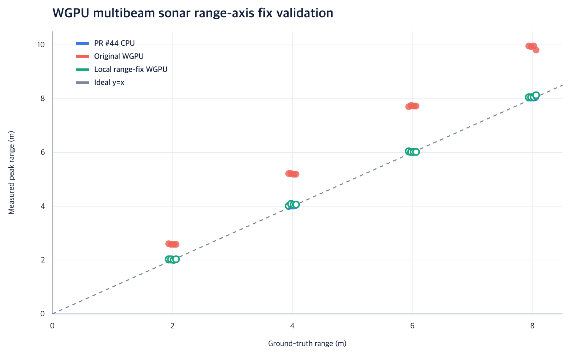
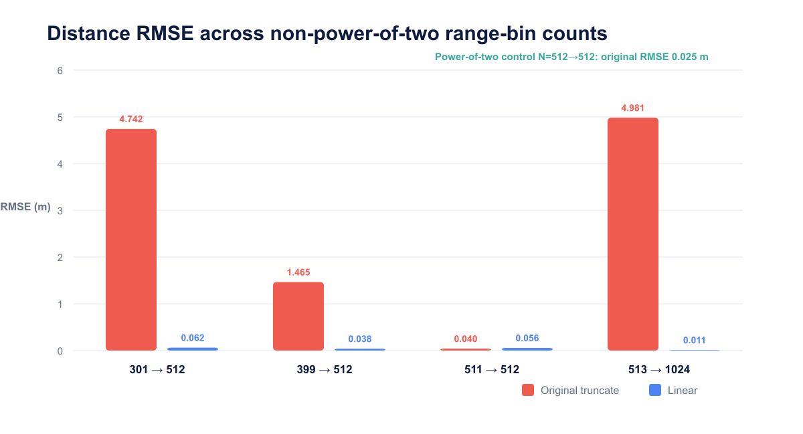

# WGPU padded-FFT range-axis validation

This note records the evidence for the range-preserving writeback candidate in
PR #44. The measurements were taken from the PR head at
`6aef91c823af5da073329b84ba617b572965e79e` and from the candidate shader change
applied on top of that commit.

## Problem

The WGPU path pads `n_freq` to the next power of two before running its FFT. For
the default sonar configuration, `n_freq = 399` and `padded_n = 512`. The
original shader copied `smem[i]` directly into output bin `i`, while the ROS
message continued to use the original 399-bin physical range vector.

The expected error signature is therefore

```text
reported range = physical range * padded_n / n_freq
```

For 399 -> 512, the scale is `1.283208`. With a 10 m configured maximum range,
the expected far-range clipping threshold is `10 * 399 / 512 = 7.792969 m`.

## Candidate

The candidate keeps the zero-padded power-of-two FFT. During writeback, output
bin `i` samples the complex padded spectrum at `i * padded_n / n_freq` and uses
linear interpolation between the adjacent samples. The output buffer and
published physical range vector remain `n_freq` bins long.

## Controlled Gazebo experiment

- Platform: Apple M2, Metal 3, macOS 15.7.3
- Software: ROS 2 Lyrical, Gazebo Sim 10.5.0
- Target: one planar panel with its front face placed at the commanded range
- Range: 2, 4, 6, and 8 m
- Incidence angle: 0, 15, 30, and 45 degrees
- Samples: five frames for each backend and condition
- Oracle: an independent PointCloud range measurement checked target placement
- Boundary exclusion: 10 m was excluded because the PointCloud oracle was not
  available at the configured maximum range

The peak range was extracted from the median profile over the five collected
frames. RMSE, MAE, bias, and maximum absolute error were then calculated against
the commanded front-face range.

| Backend | RMSE (m) | MAE (m) | Max abs. error (m) |
| --- | ---: | ---: | ---: |
| PR #44 CPU | 0.0134 | 0.0111 | 0.0268 |
| Original PR #44 WGPU | 1.4532 | 1.3587 | 1.9582 |
| Candidate WGPU writeback | 0.0540 | 0.0449 | 0.1271 |

The candidate reduced range RMSE by `96.28%` relative to the original WGPU
writeback in this test matrix.



The 16 paired conditions and their measured values are available in
[`rangefix_paired_accuracy.csv`](rangefix_paired_accuracy.csv).

## Range-bin checks

The same mechanism was checked using other non-power-of-two range-bin counts.
These are four-distance exploratory checks rather than the full angle matrix.

| `n_freq` -> FFT size | Original RMSE (m) | Candidate RMSE (m) |
| --- | ---: | ---: |
| 301 -> 512 | 4.7419 | 0.0616 |
| 399 -> 512 | 1.4645 | 0.0385 |
| 511 -> 512 | 0.0397 | 0.0562 |
| 513 -> 1024 | 4.9812 | 0.0110 |

An unmodified `512 -> 512` power-of-two control produced `0.0252 m` RMSE,
supporting padding-grid mismatch as the dominant mechanism in these controlled
tests.



The range-bin summaries are available in
[`rangebin_summary.csv`](rangebin_summary.csv).

## Current limitations

- NVIDIA CUDA equivalence has not yet been tested.
- The `511 -> 512` case did not benefit from linear interpolation. A no-op or
  adaptive policy near a unity padding ratio should be reviewed before treating
  this candidate as a universal solution.
- The evidence is limited to controlled Gazebo targets on Apple Metal. It does
  not establish HIL, physical-sonar, or real-ocean accuracy.
- End-to-end timing samples overlap; they do not isolate the FFT writeback cost.

The candidate should therefore be reviewed as a focused correction for the
observed padded-grid range mapping, not as a claim of complete backend
equivalence.
